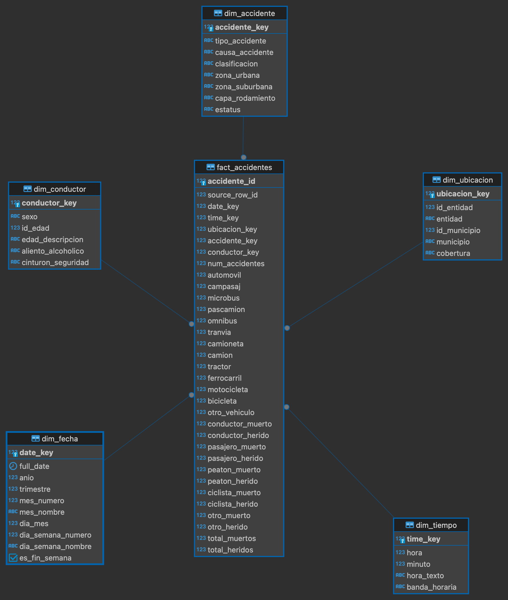

# 🚗 Análisis de siniestralidad vial en México — ATUS 2024

> El objetivo de este proyecto es construir un flujo completo de datos: desde los microdatos públicos del INEGI hasta un modelo dimensional en Aurora PostgreSQL, consultas analíticas avanzadas y un dashboard interactivo.

---

## 📋 Resumen ejecutivo

| Campo                  | Valor                                                                                                                                                                                                           |
| ---------------------- | --------------------------------------------------------------------------------------------------------------------------------------------------------------------------------------------------------------- |
| **Pregunta analítica** | ¿Cuáles son los patrones geográficos, temporales y de severidad de los accidentes viales registrados en México durante 2024, y qué factores se asocian con una mayor cantidad de personas heridas? |
| **Dataset**            | Microdatos anuales de Accidentes de Tránsito Terrestre en Zonas Urbanas y Suburbanas (ATUS), año 2024.                                                                                                          |
| **Fuente**             | [INEGI — Accidentes de Tránsito Terrestre en Zonas Urbanas y Suburbanas (ATUS)](https://www.inegi.org.mx/programas/accidentes/?ps=Microdatos)                                                                   |
| **Volumen**            | Aproximadamente 390 mil registros de accidentes viales.                                                                                                                                                         |
| **Modelo**             | Esquema estrella con 1 tabla de hechos y 5 dimensiones: fecha, tiempo, ubicación, accidente y conductor.                                                                                                        |
| **Infraestructura**    | Aurora PostgreSQL en AWS, schema `atus_dwh`.                                                                                                                                                                    |
| **ETL**                | Python con `pandas`, `SQLAlchemy` y validaciones post-carga.                                                                                                                                                    |
| **SQL avanzado**       | CTEs, funciones de ventana, rankings, variaciones temporales, agregaciones condicionales y análisis de severidad.                                                                                               |
| **Dashboard**          | Dashboard interactivo desarrollado con `Streamlit` y `Plotly`.                                                                                                                                                  |

---

## 🎯 Problema y motivación

Los accidentes viales constituyen un problema relevante para la movilidad, la seguridad pública y la planeación urbana. Analizar únicamente el número total de accidentes no permite identificar dónde, cuándo y bajo qué condiciones se presentan los eventos más severos.

El dataset ATUS del INEGI permite estudiar los accidentes viales desde distintas perspectivas:

* Ubicación geográfica.
* Fecha y horario.
* Tipo de accidente.
* Causa presunta.
* Perfil de la persona conductora.
* Cantidad y tipo de vehículos involucrados.
* Número de personas heridas y fallecidas.

Este proyecto transforma los microdatos originales en un modelo dimensional que permite responder preguntas concretas:

1. **¿Qué entidades y municipios concentran la mayor cantidad de accidentes viales?**
2. **¿Existen patrones por mes, día de la semana y franja horaria?**
3. **¿Qué proporción de accidentes corresponde a sólo daños, no fatales y fatales?**
4. **¿Qué tipos de vehículos están involucrados con mayor frecuencia en los accidentes registrados?**

---

## 📦 Origen de los datos

Los datos provienen del programa estadístico **ATUS** del Instituto Nacional de Estadística y Geografía (INEGI).

El archivo principal utilizado es:

```text
atus_anual_2024.csv
```

Además, la descarga incluye catálogos auxiliares para enriquecer los datos:

```text
tc_entidad.csv
tc_municipio.csv
tc_periodo_mes.csv
tc_dia.csv
tc_hora.csv
tc_minuto.csv
tc_edad.csv
diccionario_de_datos_atus_anual_1997_2024.csv
```

Los CSV originales se almacenan localmente en:

```text
data/raw/
```

Los archivos de datos no se cargan al repositorio debido a su tamaño. El repositorio contiene código, scripts SQL, documentación, diagrama del modelo y dashboard.

---

## 🔄 Flujo end-to-end

```text
┌──────────────────────────────────────────────┐
│ INEGI — Microdatos ATUS 2024                 │
│                                              │
│ • Archivo anual de accidentes                │
│ • Catálogos de entidad, municipio y tiempo   │
│ • Diccionario de datos                       │
└──────────────────────┬───────────────────────┘
                       │
                       │ Descarga desde portal público
                       ▼
┌──────────────────────────────────────────────┐
│ Archivos locales — data/raw/                 │
│                                              │
│ atus_anual_2024.csv                          │
│ tc_entidad.csv                               │
│ tc_municipio.csv                             │
│ tc_hora.csv                                  │
│ tc_minuto.csv                                │
│ tc_periodo_mes.csv                           │
│ tc_dia.csv                                   │
│ tc_edad.csv                                  │
└──────────────────────┬───────────────────────┘
                       │
                       │ ETL Python
                       ▼
┌──────────────────────────────────────────────┐
│ Transformación con pandas                    │
│                                              │
│ Extract:   lectura de CSVs                   │
│ Transform: limpieza, cruces y validaciones   │
│ Resolve:   generación de surrogate keys      │
│ Load:      carga con SQLAlchemy              │
└──────────────────────┬───────────────────────┘
                       │
                       │ INSERT
                       ▼
┌──────────────────────────────────────────────┐
│ Aurora PostgreSQL                            │
│ Schema: atus_dwh                             │
│                                              │
│ • 5 dimensiones                              │
│ • 1 tabla de hechos                          │
│ • Índices para consultas analíticas          │
└──────────────────────┬───────────────────────┘
                       │
                       │ SELECT
                       ▼
┌──────────────────────────────────────────────┐
│ SQL avanzado + dashboard                     │
│                                              │
│ • Rankings geográficos                       │
│ • Tendencias temporales                      │
│ • Análisis de severidad                      │
│ • Visualizaciones interactivas               │
└──────────────────────────────────────────────┘
```

---

## ⭐ Modelo dimensional

El proyecto utiliza un **esquema estrella** con una tabla de hechos central y cinco dimensiones.



### Tablas del modelo

```text
atus_dwh
├── dim_fecha
├── dim_tiempo
├── dim_ubicacion
├── dim_accidente
├── dim_conductor
└── fact_accidentes
```

### Esquema conceptual

```text
                         ┌────────────────────────────┐
                         │         dim_fecha          │
                         │────────────────────────────│
                         │ date_key PK                │
                         │ full_date                  │
                         │ anio                       │
                         │ trimestre                  │
                         │ mes_numero                 │
                         │ mes_nombre                 │
                         │ dia_mes                    │
                         │ dia_semana_numero          │
                         │ dia_semana_nombre          │
                         │ es_fin_semana              │
                         └──────────────▲─────────────┘
                                        │
                                        │
┌────────────────────────────┐          │          ┌────────────────────────────┐
│       dim_ubicacion        │          │          │       dim_accidente        │
│────────────────────────────│          │          │────────────────────────────│
│ ubicacion_key PK           │◄─────────┼─────────►│ accidente_key PK           │
│ id_entidad                 │          |           │ tipo_accidente             │
│ entidad                    │          |           │ causa_accidente            │
│ id_municipio               │          |           │ clasificacion              │
│ municipio                  │          |           │ zona_urbana                │
│ cobertura                  │          |           │ zona_suburbana             │
└────────────────────────────┘          |           │ capa_rodamiento            │
                                        |           │ estatus                    │
                                        |           └────────────────────────────┘
                                        │
                                        │
                         ┌──────────────▼─────────────┐
                         │      fact_accidentes       │
                         │────────────────────────────│
                         │ accidente_id PK            │
                         │ source_row_id              │
                         │ date_key FK                │
                         │ time_key FK                │
                         │ ubicacion_key FK           │
                         │ accidente_key FK           │
                         │ conductor_key FK           │
                         │ num_accidentes             │
                         │ total_muertos              │
                         │ total_heridos              │
                         │ automovil                  │
                         │ motocicleta                │
                         │ bicicleta                  │
                         │ camion                     │
                         │ camioneta                  │
                         └──────────────▲─────────────┘
                                        │
                ┌───────────────────────┴───────────────────────┐
                │                                               │
┌───────────────┴──────────────┐                ┌───────────────┴──────────────┐
│         dim_tiempo           │                │        dim_conductor         │
│──────────────────────────────│                │──────────────────────────────│
│ time_key PK                  │                │ conductor_key PK             │
│ hora                         │                │ sexo                         │
│ minuto                       │                │ id_edad                      │
│ hora_texto                   │                │ edad_descripcion             │
│ banda_horaria                │                │ aliento_alcoholico           │
└──────────────────────────────┘                │ cinturon_seguridad           │
                                                └──────────────────────────────┘
```

---

## 🧠 Decisiones de diseño

**Grano de la fact:** una fila por accidente vial registrado en ATUS. Este es el nivel más fino que provee el origen. Cada registro representa un evento ocurrido en una ubicación, fecha y horario determinados, junto con sus atributos de severidad, características del conductor y vehículos involucrados.

**Decisiones sobre dim_tiempo` y `dim_fecha`:** Se decidió separarlos debido a que los patrones diarios y los patrones horarios responden a preguntas diferentes. La separación facilita analizar tendencias por mes o día de la semana, al mismo tiempo que permite agrupar por franja horaria sin reconstruir timestamps en cada consulta.

**Decisiones sobre el porque `dim_ubicacion` integra entidad y municipio:** el municipio pertenece naturalmente a una entidad federativa. Ambos atributos se aplanan en una sola dimensión para simplificar las consultas geográficas y evitar una normalización innecesaria dentro del esquema estrella.

**Decisiones sobre el porque `dim_accidente` concentra tipo, causa y clasificación:** estas variables describen la naturaleza del evento vial. Agruparlas en una dimensión facilita comparar frecuencia y severidad entre atropellamientos, colisiones, volcaduras y otros tipos de accidente.

**Decisiones sobre el porque `dim_conductor` se mantiene separada:** variables como sexo, edad, aliento alcohólico y uso del cinturón corresponden al perfil de la persona conductora. Mantenerlas en una dimensión propia permite estudiar su relación con la severidad del accidente.

**Decisiones sobre el porque los vehículos permanecen en la fact:** ATUS reporta los vehículos involucrados como conteos por accidente. Estas columnas son medidas aditivas, por lo que pueden agregarse directamente mediante `SUM()` sin crear una relación muchos-a-muchos adicional.

**Decisiones sobre el porque conserva la medida `num_accidentes`:** cada registro recibe el valor constante `1`. Esto permite calcular el total de accidentes con `SUM(num_accidentes)` y mantener consistencia con las demás métricas agregables.

**Decisiones sobre el porque `source_row_id`:** se conserva un identificador técnico de la fila original del CSV para trazabilidad e idempotencia durante el proceso ETL.

**Por qué no se filtran los accidentes clasificados como “sólo daños”:** estos registros también forman parte de la siniestralidad vial. Excluirlos sesgaría el análisis al concentrarse únicamente en accidentes con personas heridas o fallecidas.

---

## 🛠️ Proceso ETL

El ETL se implementó en Python con `pandas` y `SQLAlchemy`.

Archivo principal:

```text
scripts/etl_pipeline_atus2024.py
```

El proceso realiza:

1. Lectura de archivos CSV desde `data/raw/`.
2. Limpieza de columnas y normalización de tipos de dato.
3. Cruce con catálogos de entidad, municipio y edad.
4. Construcción de dimensiones derivadas:

   * `dim_ubicacion`
   * `dim_accidente`
   * `dim_conductor`
5. Resolución de surrogate keys.
6. Carga de `fact_accidentes`.
7. Validaciones post-carga:

   * conteo de registros cargados
   * llaves nulas
   * totales generales
   * top de entidades por accidentes

Las dimensiones `dim_fecha` y `dim_tiempo` se cargan previamente mediante SQL.

---

## 🔎 Consultas analíticas

Las consultas analíticas se encuentran en:

```text
analisis/queries_analiticas.sql
```

El análisis final se compone de **7 consultas principales**, alineadas con las visualizaciones del dashboard interactivo:

### 1. Ranking de entidades con mayor número de accidentes

**Pregunta:**
¿Qué entidades concentran la mayor cantidad de accidentes viales en 2024?

**Técnica SQL utilizada:**
`GROUP BY` + `RANK() OVER()`

Esta consulta agrega los accidentes por entidad federativa y genera un ranking descendente para identificar las zonas con mayor concentración de siniestros viales.

---

### 2. Tendencia mensual de accidentes

**Pregunta:**
¿Cómo evolucionó el número de accidentes viales a lo largo de 2024?

**Técnica SQL utilizada:**
`CTE` + `LAG() OVER()`

La consulta calcula el total mensual de accidentes y compara cada mes contra el mes anterior mediante una función de ventana. Esto permite observar variaciones mensuales y detectar periodos con aumentos o disminuciones relevantes.

---

### 3. Promedio móvil semanal de accidentes

**Pregunta:**
¿Existen periodos con incrementos sostenidos en la frecuencia de accidentes?

**Técnica SQL utilizada:**
`AVG() OVER()` con ventana móvil de 7 días

La consulta calcula el total diario de accidentes y un promedio móvil de 7 días. Esto suaviza la variabilidad diaria y permite identificar tendencias más estables en la siniestralidad.

---

### 4. Accidentes por día de semana y banda horaria

**Pregunta:**
¿En qué combinaciones de día de semana y franja horaria se concentran más accidentes?

**Técnica SQL utilizada:**
`GROUP BY` + ordenamiento personalizado con `CASE`

La consulta cruza la dimensión de fecha con la dimensión de tiempo para analizar accidentes por día de la semana y banda horaria: madrugada, mañana, tarde, noche o sin especificar.

---

### 5. Municipios con mayor siniestralidad dentro de cada entidad

**Pregunta:**
¿Cuáles son los municipios con más accidentes dentro de cada entidad federativa?

**Técnica SQL utilizada:**
`ROW_NUMBER() OVER(PARTITION BY entidad)`

Esta consulta calcula el total de accidentes por municipio y genera un ranking interno por entidad. Permite identificar los municipios más relevantes dentro de cada estado.

---

### 6. Participación porcentual de accidentes por clasificación

**Pregunta:**
¿Qué proporción de accidentes corresponde a sólo daños, no fatales y fatales?

**Técnica SQL utilizada:**
`SUM() OVER()` para calcular porcentaje sobre el total

La consulta agrupa los accidentes por clasificación y calcula su participación porcentual respecto al total nacional. Esto permite distinguir entre accidentes de sólo daños, no fatales y fatales.

---

### 7. Vehículos más involucrados en accidentes

**Pregunta:**
¿Qué tipos de vehículos aparecen con mayor frecuencia en los accidentes registrados?

**Técnica SQL utilizada:**
`UNION ALL` para unpivot manual + `RANK() OVER()`

Dado que ATUS reporta los vehículos involucrados como columnas separadas, esta consulta transforma dichas columnas en filas mediante `UNION ALL`. Después calcula el total por tipo de vehículo y genera un ranking.

---

### Resumen de técnicas SQL utilizadas

| Consulta                      | Técnica principal                     |
| ----------------------------- | ------------------------------------- |
| Ranking de entidades          | `RANK() OVER()`                       |
| Tendencia mensual             | `LAG() OVER()`                        |
| Promedio móvil semanal        | `AVG() OVER()`                        |
| Día de semana × banda horaria | `GROUP BY` + `CASE`                   |
| Top municipios por entidad    | `ROW_NUMBER() OVER(PARTITION BY ...)` |
| Clasificación de accidentes   | `SUM() OVER()`                        |
| Vehículos involucrados        | `UNION ALL` + `RANK() OVER()`         |

## 📊 Dashboard interactivo

El dashboard se desarrolló con:

```text
Streamlit + Plotly
```

Archivo principal:

```text
dashboard/app.py
```

El dashboard permite visualizar:

* KPIs generales de accidentes, muertos y heridos.
* Ranking de entidades con más accidentes.
* Top de municipios por entidad.
* Tendencia mensual de accidentes.
* Promedio móvil semanal.
* Heatmap por día de semana y banda horaria.
* Distribución por clasificación del accidente.
* Perfil del conductor en accidentes con víctimas.
* Vehículos más involucrados.

---

## 📌 Hallazgos principales

### 1. Concentración geográfica

El análisis muestra una fuerte concentración de accidentes en ciertas entidades. **Nuevo León** destaca como la entidad con mayor número de accidentes viales registrados en ATUS 2024, con una diferencia considerable respecto al resto del top 10.

Después aparecen entidades como **Chihuahua**, **Sonora**, **México**, **Jalisco** y **Guanajuato**, lo que sugiere que la siniestralidad vial no se distribuye de manera uniforme en el país.

---

### 2. Comportamiento mensual relativamente estable

La tendencia mensual de accidentes muestra que el número de eventos se mantiene relativamente estable durante 2024, con valores cercanos a los **30 mil–35 mil accidentes mensuales**.

Se observa un aumento hacia **mayo**, una disminución en **julio** y un nuevo incremento hacia **octubre y noviembre**.

---

### 3. Predominio de accidentes de sólo daños

La mayoría de los accidentes registrados corresponde a la clasificación **“Sólo daños”**, con aproximadamente **82.6%** del total.

Los accidentes **no fatales** representan alrededor de **16.4%**, mientras que los **fatales** son una proporción menor, cercana a **1.07%**.

Este resultado muestra que, aunque la mayoría de los eventos no involucra víctimas, existe un subconjunto relevante de accidentes con consecuencias humanas.

---

### 4. Automóviles como vehículo más frecuente

El **automóvil** aparece como el tipo de vehículo más involucrado en accidentes, con una diferencia amplia respecto al resto.

En segundo lugar aparecen las **motocicletas**, seguidas por **camionetas** y **camiones**. Esto sugiere que el análisis de siniestralidad vial debe considerar tanto el volumen de circulación como la vulnerabilidad de ciertos usuarios viales.

---

### 5. Importancia de separar frecuencia y severidad

El proyecto permite distinguir entre:

```text
Frecuencia  → cuántos accidentes ocurren
Severidad   → cuántas personas resultan heridas o fallecidas
```

Esta separación es importante porque una entidad puede concentrar muchos accidentes de sólo daños, mientras que otra con menos eventos puede tener mayor proporción de accidentes con víctimas.

---


## 📂 Estructura del repositorio

```text
ATUS-2024-Siniestralidad-Vial/
├── README.md
├── .gitignore
│
├── data/
│   ├── raw/                         ← CSVs locales, excluidos de GitHub
│   └── processed/                   ← archivos intermedios, excluidos de GitHub
│
├── docs/
│   └── esquema_estrella_atus.png    ← diagrama ER del modelo dimensional
│
├── scripts/
│   ├── 01_schema_ddl.sql            ← creación del esquema estrella
│   ├── 02_dim_fecha_tiempo_populate.sql
│   └── etl_pipeline_atus2024.py     ← ETL Python end-to-end
│
├── analisis/
│   └── queries_analiticas.sql       ← consultas SQL avanzadas
│
└── dashboard/
    └── app.py                       ← dashboard interactivo en Streamlit
```

---

## 👀 Para las visualizaciones

Al abrir el dashboard interactivo para visualizar los KPI's de las consultas, ingresar desde la raíz del proyecto:

```bash
python3 -m streamlit run dashboard/app.py
```

Al abrirse el dashboard en el navegador, ingresa la contraseña de la base de datos en el panel lateral, dentro estarán todos los KPI's realizados.

---

## 👤 Autor

**Aldo Ramírez Alanís**

Proyecto final del módulo de Business Intelligence y SQL Avanzado.
